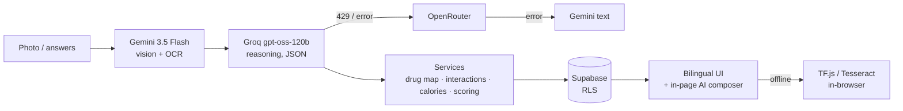

# ShasthyaHub-AI

[](https://github.com/Mahimrio/ShasthyaHub-AI/actions/workflows/ci.yml)

Multi-agent AI healthcare web app for rural Bangladesh — built for **AUST CSE Carnival 8.0 (Project Showcase)**.

> স্বাস্থ্যসেবা, সবার জন্য — AI screening that explains itself in Bangla, works on cheap phones, and knows when to say "see a doctor".

## Team

Team ShasthyaHub

## What it does

Four specialised AI agents, one general assistant, and a family layer that lets caregivers look after relatives — all bilingual (বাংলা + English), dark-mode ready, and installable as a PWA with offline fallbacks.

| Agent | What you give it | What you get back |
|-------|------------------|-------------------|
| **Nayan AI** (নয়ন) | A close-up eye photo | Cataract / diabetic-retinopathy / conjunctivitis triage with severity, confidence, urgency and the specialist to see. Falls back to an on-device TensorFlow.js model when offline. |
| **ScriptGuard** (স্ক্রিপ্টগার্ড) | A prescription photo | OCR → brand→generic mapping (65+ Bangladeshi drugs) → drug-interaction safety check (OpenFDA evidence) → daily schedule with reminders → Bengali audio guide. Human-in-the-loop editing of every medicine. Offline OCR via Tesseract.js. |
| **GlycoVision** (গ্লাইকোভিশন) | A photo of a meal | Food items, calories, macros, glycemic load, diabetes / blood-pressure / heart risk flags and healthier swaps — tuned to Bangladeshi cuisine (85+ local foods). |
| **Lokhon** (লক্ষণ) | A symptom questionnaire | Zero-LLM weighted screening for heart disease, diabetes, kidney, hypertension, asthma, fever and depression. Red-flag answers force *Urgent*; the depression screening never shows a score and opens a crisis path (Shuchona 16463). |

Around the agents:

- **Ask &lt;agent&gt; composers** — every agent page has an in-page AI composer (cloud-AI style: growing textbox, mode chips, paperclip, round send). It answers only about that agent and the analysis on screen, with *Simple words* and *Doctor questions* modes, a **History** overlay that reopens earlier conversations, and streaming replies with a stop button.
- **Shasthya Bondhu** (স্বাস্থ্য বন্ধু) — the floating general assistant on the Home and reports pages: streams answers, knows your recent reports, escalates emergencies (999 / 16263 / 16463) and reads replies aloud in Bengali.
- **Poribar** (পরিবার) — family connections with relation types, a family tree, shared health summaries, caregiver alerts for missed doses and real "nudge" reminders between connected members.
- **Medication reminders** — schedules generated from prescriptions, a virtual pillbox with refill tracking, snooze/taken/missed logging in the user's own timezone, audio chimes and browser notifications.
- **Reports** — every analysis is stored and browsable; a health score summarises trends.
- **Public demos** at `/demo` for judges — no login needed.

Everything is a screening aid, not a diagnosis, and every reply ends by pointing to a qualified doctor.

## Tech stack

- **Framework**: Next.js 16 (App Router, Turbopack), React 19, TypeScript strict
- **Database & auth**: Supabase (PostgreSQL, Auth, Storage) — row-level security on every table
- **Styling**: Tailwind CSS v4, shadcn/ui, framer-motion; **Plus Jakarta Sans** (Latin) + **Hind Siliguri** (Bengali) via `next/font`
- **State**: TanStack React Query
- **AI**
  - Vision & text: Google **Gemini 3.5 Flash** (multi-key pool, rotates on 429)
  - Reasoning: **Groq `openai/gpt-oss-120b`** (JSON pipelines + plain-text streaming chat)
  - Fallbacks: OpenRouter (`minimax/minimax-m3:free`) → Gemini text
  - Speech: Gemini 3.1 Flash TTS (Bengali, server-side PCM→WAV)
  - Offline: TensorFlow.js CNN (Nayan AI), Tesseract.js eng+ben (ScriptGuard)
- **i18n**: cookie-based BN/EN resolved server-side for a flicker-free first paint
- **PWA**: hand-written service worker — offline queue, model/lang-pack caching
- **Deployment**: Vercel (60 s API `maxDuration`), GitHub Actions CI

### AI pipeline



## Getting started

### Prerequisites

- Node.js 20 (CI runs on 20), npm
- A Supabase project
- API keys: Google Gemini, Groq (required); OpenRouter, USDA FoodData (optional)

### Install

```bash
git clone https://github.com/Mahimrio/ShasthyaHub-AI.git
cd ShasthyaHub-AI
npm install
cp .env.example .env.local
```

Fill in `.env.local`:

```env
NEXT_PUBLIC_SUPABASE_URL=your_supabase_url
NEXT_PUBLIC_SUPABASE_ANON_KEY=your_supabase_anon_key
SUPABASE_SERVICE_ROLE_KEY=your_service_role_key

GEMINI_API_KEY=your_gemini_api_key
# Optional: comma-separated keys from separate Cloud projects (rotates on 429)
GEMINI_API_KEYS=key_one,key_two
GROQ_API_KEY=your_groq_api_key
# Optional: extra reasoning fallback (Groq -> OpenRouter -> Gemini)
OPENROUTER_API_KEY=your_openrouter_key
USDA_API_KEY=your_usda_api_key

NEXT_PUBLIC_APP_URL=http://localhost:3000
```

Check the keys before you start (new Gemini keys only work with 3.x models):

```bash
node scripts/check-env.mjs    # every required variable present?
node scripts/probe-keys.mjs   # live probe of Gemini / Groq / OpenRouter
```

### Database

Run these in the Supabase SQL editor, in order:

1. `supabase/schema.sql` — core tables (profiles, eye/prescription/food analyses)
2. `supabase/seed.sql` — `bd_drugs` (65 rows) and `bd_food_items` (85 rows)
3. `supabase/storage-setup.sql` — image buckets
4. `supabase/doctors.sql` — doctors directory
5. `supabase/migrations/001` … `007` (see table below). Every migration is idempotent and safe to re-run.

| Migration | Adds |
|-----------|------|
| 001 | Chronic-disease risk flags on food analyses |
| 002 | `analysis_mode` (online/offline) columns |
| 003 | `chat_messages` for Shasthya Bondhu |
| 004 | Family system: usernames, `family_connections`, family RLS |
| 005 | Medication reminders: schedules, dose logs, reminder settings |
| 006 | Family security hardening (profile visibility, invite acceptance), `caregiver_nudges`, signup trigger fix |
| 007 | `chat_messages.scope` + `context_id` so page composers keep their own conversation history |

### Run

```bash
npm run dev        # http://localhost:3000
```

Sign up, or open `/demo` to try the agents without an account.

### Try it with the bundled test images

`test-images/` contains real-world samples that exercise every vision agent:

| File | Use on | Expected |
|------|--------|----------|
| `test-images/Eye.png` | Nayan AI | Mature cataract, high severity, ophthalmologist within days |
| `test-images/Prescription.png` | ScriptGuard | ~10 medicines, brand→generic mapping, at least one flagged interaction |
| `test-images/Kacchi.png` | GlycoVision | Kacchi biryani plate — red risk level, glycemic load ~40 |

Upload them through the page, or through the paperclip in the page's AI composer.

## Project structure

```
ShasthyaHub-AI/
├── app/
│   ├── (auth)/                 # login, register, forgot-password
│   ├── (dashboard)/            # protected pages
│   │   ├── page.tsx            # home: health score, agents, recent activity
│   │   ├── nayan-ai/  scriptguard/  glycovision/  lokhon/[slug]/
│   │   ├── family/             # Poribar family tree + caregiver alerts
│   │   ├── reports/            # history & detail
│   │   └── debug-offline/      # dev-only offline diagnostics
│   ├── demo/                   # public demos
│   └── api/
│       ├── nayan/  scriptguard/  glycovision/  lokhon/   # agent pipelines (+ TTS, doctors, drug verify)
│       ├── chat/               # Shasthya Bondhu stream
│       ├── chat/scoped/        # page-scoped composer stream + history
│       ├── family/             # connections, tree, member reports, medications, caregiver alerts
│       ├── medications/        # schedules, dose logs, refills, settings
│       └── reports/  profile/  health/
├── components/
│   ├── chat/                   # Shasthya Bondhu widget
│   ├── chat/scoped/            # PageChat, ChatComposer, transcript, history overlay
│   ├── features/               # per-agent UI (nayan-ai, scriptguard, glycovision, lokhon, family, medications)
│   ├── layout/  shared/  ui/   # nav, footer, brand wordmark, uploader, shadcn primitives
│   └── auth/                   # landing / auth screens
├── contexts/                   # language, dark mode, page-chat presence
├── hooks/                      # analysis, history, chat, family, medication hooks
├── lib/
│   ├── ai/                     # gemini, groq, openrouter, chat, chat-stream, scoped-context, TF.js, Tesseract
│   ├── services/               # drug mapping, interactions, calorie lookup, Lokhon scoring, schedules
│   ├── family/  medications/   # authorization helpers, nudges, local stores
│   └── supabase/               # server & browser clients
├── supabase/                   # schema, seed, storage, doctors, migrations 001–007
├── public/                     # sw.js, icons, TF.js model, Tesseract language packs
├── scripts/                    # check-env, probe-keys, audit-nayan, generate-icons
├── test-images/                # sample eye / prescription / meal photos
└── types/index.ts              # shared TypeScript types
```

## API overview

| Route | Purpose |
|-------|---------|
| `POST /api/nayan/analyze` · `GET /api/nayan/doctors` | Eye screening; specialists near the user |
| `POST /api/scriptguard/analyze` · `/verify-drug` · `/tts` | Prescription pipeline; drug verification; Bengali speech |
| `POST /api/glycovision/analyze` | Meal analysis |
| `GET /api/lokhon/diseases` · `POST /api/lokhon/[disease]/evaluate` | Questionnaires and weighted scoring |
| `POST /api/chat` | Shasthya Bondhu streaming chat |
| `POST /api/chat/scoped` · `GET /api/chat/scoped/history` | Page-scoped composer stream; earlier conversations |
| `/api/family/*` | Search, connections, tree, member reports & medications, caregiver alerts, nudges |
| `/api/medications/*` | Schedules, dose logs (timezone-aware), refills, reminder settings |
| `/api/reports`, `/api/reports/health-score`, `/api/reports/detail` | History and health score |

All routes require a Supabase session (except `/api/health` and the demo endpoints), are rate-limited per user, and return bilingual errors (`error`, `error_bn`).

## Scripts

| Command | Action |
|---------|--------|
| `npm run dev` | Development server |
| `npm run build` | Production build |
| `npm run start` | Serve the production build |
| `npm run lint` | ESLint |
| `npm run type-check` | `tsc --noEmit` |
| `node scripts/check-env.mjs` | Verify `.env.local` |
| `node scripts/probe-keys.mjs` | Live-check AI keys and models |

## Safety & privacy

- Every table is protected by row-level security; family data is readable only across accepted connections.
- Emergency keywords (Bangla and English) trigger an on-screen crisis card with 999, 16263 (Shastho Batayon) and 16463 (Shuchona) — and the assistants are instructed to lead with those numbers.
- The assistants never diagnose or change medication; every answer ends with a reminder to confirm with a doctor.

## Deployment

Import the repo in Vercel, add the environment variables above, and deploy. Preview deployments run on every PR; `main` deploys to production. API routes get a 60 s `maxDuration` via `vercel.json`.

## Contributing

See [CONTRIBUTING.md](CONTRIBUTING.md) for setup, branch/commit rules and the pre-push checklist. Agent-specific implementation notes live in [AGENTS.md](AGENTS.md).

## License

MIT License — Built for AUST CSE Carnival 8.0 (Project Showcase)
