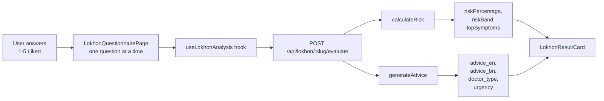

# Lokhon — Symptom Checker

> লোকন — লক্ষণ পরীক্ষা  
> *Built for SciBlitz AI Challenge 2026, Track A.*

Lokhon is a structured symptom-screening module that guides users through a disease-specific questionnaire, computes a deterministic risk score, and provides actionable advice. It covers **7 common health conditions** relevant to rural Bangladesh.

---

## Routes

| Path | Page | Description |
|------|------|-------------|
| `/lokhon` | Disease list | Shows all 7 screening modules |
| `/lokhon/[slug]` | Questionnaire | One question at a time, Likert 1–5 |
| `/api/lokhon/diseases` | API (GET) | Returns `{ diseases, questions }` |
| `/api/lokhon/[disease]/evaluate` | API (POST) | Submits answers, returns result |

---

## Diseases Covered

| Slug | Questions | Est. time | Sources |
|------|-----------|-----------|---------|
| `heart` | 13 | ~4 min | Rose Angina Questionnaire (WHO), ACS red-flag symptoms |
| `diabetes` | 14 | ~4 min | ADA / NIDDK Type 2 Diabetes Risk Test domains |
| `kidney` | 15 | ~5 min | KDIGO risk-factor guidance, late-stage CKD literature |
| `hypertension` | 11 | ~3 min | Standard HTN / hypertensive-crisis symptom literature |
| `asthma` | 11 | ~4 min | Respiratory Symptoms Questionnaire (RSQ), BCSS domains |
| `fever` | 12 | ~4 min | WHO 2009 dengue classification warning signs |
| `depression` | 12 | ~4 min | General depression/anxiety symptom domains |

Total: **88 questions**.

---

## Data Source

Questions are hardcoded in `lib/services/lokhon-data.ts` as `FALLBACK_QUESTIONS` / `FALLBACK_DISEASES`. When the Supabase tables (`lokhon_diseases`, `lokhon_questions`) exist, the API queries them instead. The data file is the single source of truth for the fallback.

---

## Scoring Algorithm

Defined in `lib/services/lokhon-scoring.ts`:

1. **Normalize**: Each answer (1–5) is mapped to 0–1 via `(raw - 1) / 4`
2. **Weight**: Multiply normalized value × question weight (1, 2, or 3)
3. **Aggregate**: `sum(weighted) / sum(weights) * 100` → `riskPercentage`
4. **Red flag override**: If any `is_red_flag` question scores ≥ 4, band = **Urgent**
5. **Risk bands**:

| Percentage | Band |
|------------|------|
| 0–24 | Low |
| 25–49 | Moderate |
| 50–74 | High |
| 75–100 | Urgent |

### Special: Self-Harm Detection

If the `self_harm_thoughts` answer is ≥ 3 (on a 1–5 scale), `requiresImmediateSupport` is set to `true`. This bypasses the normal result UI and shows crisis helpline resources instead.

---

## Architecture



### Pipeline

1. **Frontend**: `app/(dashboard)/lokhon/[slug]/page.tsx` — client component, renders one question at a time with animated transitions
2. **Hook**: `hooks/useLokhonAnalysis.ts` — manages loading/error/result state
3. **API route**: `app/api/lokhon/[disease]/evaluate/route.ts`
   - Fetches questions from DB or fallback
   - Validates all questions answered
   - Calls `calculateRisk` + `generateAdvice`
   - Returns `LokhonResult`
4. **Scoring**: `lib/services/lokhon-scoring.ts` — pure function, deterministic
5. **Advice**: `lib/services/lokhon-advice.ts` — hardcoded advice per disease × riskBand, with Groq LLM fallback for custom advice
6. **Result UI**: `components/features/lokhon/LokhonResultCard.tsx` — handles three display modes:
   - **Normal**: Red-flag banner + risk gauge + advice card + top symptoms
   - **Mental health**: Soft banner ("talk to a counselor") with no numeric risk gauge
   - **Crisis** (`requiresImmediateSupport`): Helpline card with Shuchona Foundation (16463), no gauge or symptom list

---

## Components

### Feature components (`components/features/lokhon/`)

| Component | Purpose |
|-----------|---------|
| `DiseaseCard.tsx` | Card in disease list, links to questionnaire |
| `LokhonResultCard.tsx` | Result display (normal / mental health / crisis) |
| `QuestionProgress.tsx` | Progress bar showing answered/total |
| `LikertScale.tsx` | 1–5 emoji-based answer scale |
| `RiskGauge.tsx` | Animated gauge showing risk band |

### Shared components used

| Component | Purpose |
|-----------|---------|
| `AnalyzingAnimation.tsx` | Full-screen overlay while processing |
| `DisclaimerModal.tsx` | First-time disclaimer modal |
| `ResultCard.tsx` | Reusable info card shell |

---

## Mental Health Handling

The `depression` module differs from physical diseases:

1. **No risk percentage**: `riskPercentage` is set to `0` in the API response. The `RiskGauge` is hidden.
2. **Soft framing**: Results say "Your responses suggest it could help to talk to a counselor" — not a diagnostic-feeling percentage.
3. **Crisis override**: If `self_harm_thoughts` ≥ 3, the app:
   - Skips all normal result UI
   - Shows a helpline card with **Shuchona Foundation: 16463**
   - Provides a direct message: "You are not alone — help is available"
   - No risk gauge, no "doctor type" card, no gamified score

This is enforced as a hard branch in the API response and the frontend checks `requiresImmediateSupport` before rendering.

---

## Database Schema

If using Supabase instead of fallback:

```sql
CREATE TABLE lokhon_diseases (
  slug TEXT PRIMARY KEY,
  name_en TEXT NOT NULL,
  name_bn TEXT NOT NULL,
  description_en TEXT,
  description_bn TEXT,
  icon TEXT,
  estimated_time_en TEXT,
  estimated_time_bn TEXT,
  question_count INTEGER DEFAULT 0
);

CREATE TABLE lokhon_questions (
  id TEXT PRIMARY KEY,
  disease_slug TEXT NOT NULL REFERENCES lokhon_diseases(slug),
  text_en TEXT NOT NULL,
  text_bn TEXT NOT NULL,
  weight REAL NOT NULL,
  is_red_flag BOOLEAN DEFAULT FALSE,
  order_index INTEGER NOT NULL
);

CREATE TABLE lokhon_analyses (
  id UUID PRIMARY KEY DEFAULT gen_random_uuid(),
  user_id UUID REFERENCES auth.users(id),
  disease_slug TEXT NOT NULL,
  answers JSONB NOT NULL,
  risk_percentage REAL,
  risk_band TEXT,
  is_red_flag BOOLEAN,
  advice JSONB,
  doctor_type TEXT,
  created_at TIMESTAMPTZ DEFAULT NOW()
);
```

---

## Related Files

| File | Role |
|------|------|
| `lib/services/lokhon-data.ts` | Hardcoded fallback questions & diseases |
| `lib/services/lokhon-scoring.ts` | Deterministic risk calculation |
| `lib/services/lokhon-advice.ts` | Advice generation (hardcoded + Groq) |
| `hooks/useLokhonAnalysis.ts` | Client-side state for analysis flow |
| `components/features/lokhon/*.tsx` | UI components |
| `app/(dashboard)/lokhon/page.tsx` | Disease list page |
| `app/(dashboard)/lokhon/[slug]/page.tsx` | Questionnaire page |
| `app/api/lokhon/diseases/route.ts` | Diseases & questions API |
| `app/api/lokhon/[disease]/evaluate/route.ts` | Evaluate API |
| `app/demo/lokhon/page.tsx` | Demo page |
