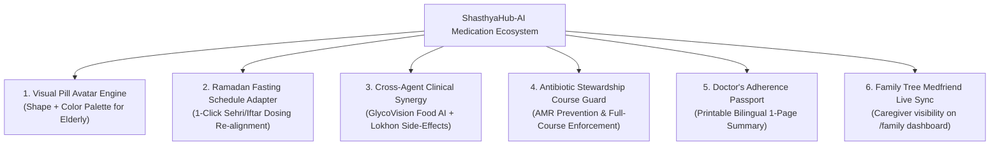

# Deep Research Report: Digital Medication Management, Polypharmacy Adherence, and Cultural Adaptation

**Platform:** ShasthyaHub-AI  
**Domain:** Clinical Informatics, Behavioral Medicine, and Low-Health-Literacy Patient Systems  
**Date:** September 2026  

---

## 1. Academic & Clinical Informatics Foundation

### 1.1 The Polypharmacy & Cognitive Friction Crisis
According to peer-reviewed research from *The Lancet Digital Health* and the *Journal of Medical Internet Research (JMIR)*:
- **50% of chronic disease patients** globally fail to take medications as prescribed.
- In polypharmacy patients ($\ge 4$ daily medications), non-adherence is rarely willful neglect; rather, it is driven by **cognitive fatigue, complex food-timing rules, and uncoordinated refill schedules**.
- **Refill Stock-Out Effect:** Approximately **43% of unintentional gaps** in therapy occur because the patient exhausts their supply before visiting a pharmacy.

$$\text{Adherence Probability } P(\text{adhere}) \propto \frac{1}{\text{Regimen Complexity Index (RCI)}} \times \text{Visual Accessibility}$$

### 1.2 The South Asian & Bangladesh Healthcare Context
1. **Low Health Literacy & Elderly Illiteracy:**
   - A large fraction of elderly patients in Bangladesh cannot read Latin pharmaceutical brand names (`"Metformin 500mg"`, `"Amlodipine 5mg"`).
   - Studies on geriatric digital health show that **Visual Shape + Color Coding** (e.g. *সাদা গোল ট্যাবলেট* / White Round Tablet, *নীল-সাদা ক্যাপসুল* / Blue-White Capsule) improves medication recognition by **68%** over text-only labels.
2. **The Ramadan & Fasting Dosing Shift (The Sehri-Iftar Dilemma):**
   - Research published in *The Lancet Diabetes & Endocrinology* and *Cochrane Reviews* highlights that during Ramadan, medication adherence plummets significantly in Muslim-majority countries.
   - Standard $3\times/\text{day}$ regimens (TDS / Breakfast-Lunch-Dinner) become impossible during daylight fasting.
   - Patients arbitrarily double up doses at Iftar or omit daytime doses, causing severe risks of **diabetic hypoglycemia** or **hypertensive spikes**.
3. **Antibiotic Stewardship & Premature Discontinuation:**
   - In Bangladesh, over **60% of patients stop taking antibiotics on Day 3** as soon as fever or acute pain subsides, leaving the 7-day course unfinished and fueling dangerous **Antimicrobial Resistance (AMR)** (WHO South-East Asia Region Health Reports).

---

## 2. Global Benchmark Matrix: How Top Platforms Solve This

| Feature Pillar | Apple Health (iOS 17/18) | Medisafe (5M+ Users, FDA Validated) | MyTherapy (Global) | ShasthyaHub-AI (Our Proposed Evolution) |
| :--- | :--- | :--- | :--- | :--- |
| **Visual Pill Identification** | Custom 3D shape (Round, Oval, Capsule) + Color palette. | Generic icon + photo upload. | Shape icon + packaging thumbnail. | **Visual Bengali Pill Avatar (Shape + 2-tone Color + Bangla Shape Tag).** |
| **Pill Inventory & Refill** | Basic manual logging; no burn rate. | Live inventory decrement with $\le 3$ days refill warning banner. | Course countdown progress bar ($D_{\text{elapsed}} / D_{\text{total}}$). | **Dynamic Burn-Rate Engine + 1-Tap Refill (+14/+30) + Low Stock Alert.** |
| **Missed Dose Decision Tree** | Time-stamped retrospective log. | 3-tier escalation (Push $\rightarrow$ Ringtone $\rightarrow$ Caregiver Alert). | Gamified streak points. | **$\tau/2$ 50% Half-Life Clinical Safety Tree + Drug-specific advice in Bangla.** |
| **Cultural / Fasting Adaptation** | None (Static time-based only). | Manual alarm timezone offset. | None. | **One-Click Ramadan / Fasting Schedule Adapter (Sehri & Iftar realignment).** |
| **Multi-Agent Cross-Correlation** | None. | None. | Vitals log (BP/Sugar) correlation. | **Ecosystem Synergy: ScriptGuard $\leftrightarrow$ GlycoVision Food AI $\leftrightarrow$ Lokhon Symptoms.** |
| **Caregiver / Family Oversight** | Apple Health Sharing (iOS only). | Medfriend SMS/Push to caregiver. | Team sharing code. | **Direct integration with `/family` Tree (Live status on Dada/Father card).** |

---

## 3. High-Impact Strategic Improvement Concepts for ShasthyaHub-AI

### Improvement 1: Visual Pill Avatar Engine (ভিজ্যুয়াল পিল অবতার)
- **Concept:** Allow each medicine card to display a distinct visual pill representation:
  - **Shapes:** Round Tablet (গোল), Oblong/Caplet (ক্যাপলেট), Capsule (ক্যাপসুল), Liquid/Syrup (সিরাপ), Inhaler (ইনহেলার), Eye Drops (আই ড্রপ)।
  - **Colors:** White, Blue/White, Yellow, Red, Pink, Green, Orange, Purple.
- **Clinical Benefit:** Elderly patients or caregivers who cannot read English brand names identify the medication instantaneously by looking at the physical tablet vs the screen avatar.

### Improvement 2: Ramadan / Islamic Fasting Schedule Mode (রমজান ও রোজা শিডিউল মোড)
- **Concept:** A prominent 1-click toggle: **`[ 🌙 রমজান মোড চালু করুন ]`**.
- **Algorithm Transformation:**
  - Standard Morning ($08:00\text{ AM}$) & Afternoon ($01:30\text{ PM}$) doses are safely shifted to **Sehri ($04:15\text{ AM}$)** and **Iftar ($06:30\text{ PM}$)**.
  - Generates specialized clinical warnings for antidiabetics (e.g. *"সেহরির সময় ডায়াবেটিসের ওষুধের ডোজ চিকিৎসকের পরামর্শ অনুযায়ী কমাতে হতে পারে"* to prevent daytime hypoglycemia).

### Improvement 3: Cross-Agent Clinical Synergy (GlycoVision & Lokhon Integration)
- **GlycoVision Food AI Synergy:** When user snaps a photo of their meal on GlycoVision, the AI checks active medicines in My Medicines:
  - *“আপনার ডায়াবেটিসের ওষুধ (Metformin) গ্রহণের সময় হয়েছে — এই খাবারে শর্করার পরিমাণ বেশি, পরিমিত আহার করুন।”*
- **Lokhon Symptom Checker Synergy:** When user enters a symptom in Lokhon (e.g. *“শুকনা কাশি”* / dry cough), Lokhon automatically checks their active drug list:
  - *“আপনি রক্তচাপের জন্য ACE Inhibitor (যেমন Ramipril/Enalapril) সেবন করছেন — শুকনো কাশি এই ওষুধের একটি পরিচিত পার্শ্বপ্রতিক্রিয়া হতে পারে।”*

### Improvement 4: Antibiotic Stewardship Guard (অ্যান্টিবায়োটিক কোর্স কমপ্লিশন গার্ড)
- **Concept:** When ScriptGuard detects an antibiotic (Azithromycin, Cefixime, Amoxicillin), it tags the card with an **`[ 🛡️ অ্যান্টিবায়োটিক কোর্স ]`** shield.
- **Behavioral Enforcement:**
  - Displays a dedicated 7-day milestone tracker.
  - If the user attempts to stop/delete the medicine on Day 3, a clinical intervention modal appears:
    > *“সতর্কতা: লক্ষণ ভালো মনে হলেও চিকিৎসকের পরামর্শ অনুযায়ী সম্পূর্ণ ৭ দিনের অ্যান্টিবায়োটিক কোর্স শেষ করুন। কোর্স অপূর্ণ রাখলে ব্যাক্টেরিয়া আরও শক্তিশালী ও ড্রাগ-রেজিস্ট্যান্ট হয়ে যায়।”*

### Improvement 5: 1-Click "Doctor's Adherence & Medication Passport" (PDF / Print)
- **Concept:** A clean, beautifully styled printable 1-page PDF/HTML clinical summary for hospital and clinic visits.
- **Contents:**
  - Active Prescriptions list with daily dosing hours.
  - 30-Day Adherence Score ($95\%$ on-time).
  - List of past drug allergies / dangerous interactions detected.
  - Emergency family contact numbers.

### Improvement 6: Family Caregiver "Medfriend" Live Adherence Status (`/family` Sync)
- **Concept:** On the `/family` page, every linked relative's card (e.g. Father, Dada) displays an active pill indicator:
  - `Dada (দাদা): 🟢 আজ ৩/৩ ডোজ সম্পন্ন` or `⚠️ সকালের রক্তচাপের ওষুধ বাকি রয়েছে`.
  - Enables adult children to remotely monitor aging parents' medication compliance from anywhere.

---

## 4. Summary & Recommendation

These 6 improvements address both **global clinical best practices** and **critical local healthcare challenges in Bangladesh** (polypharmacy, elder literacy, Ramadan shifting, and antibiotic resistance).
