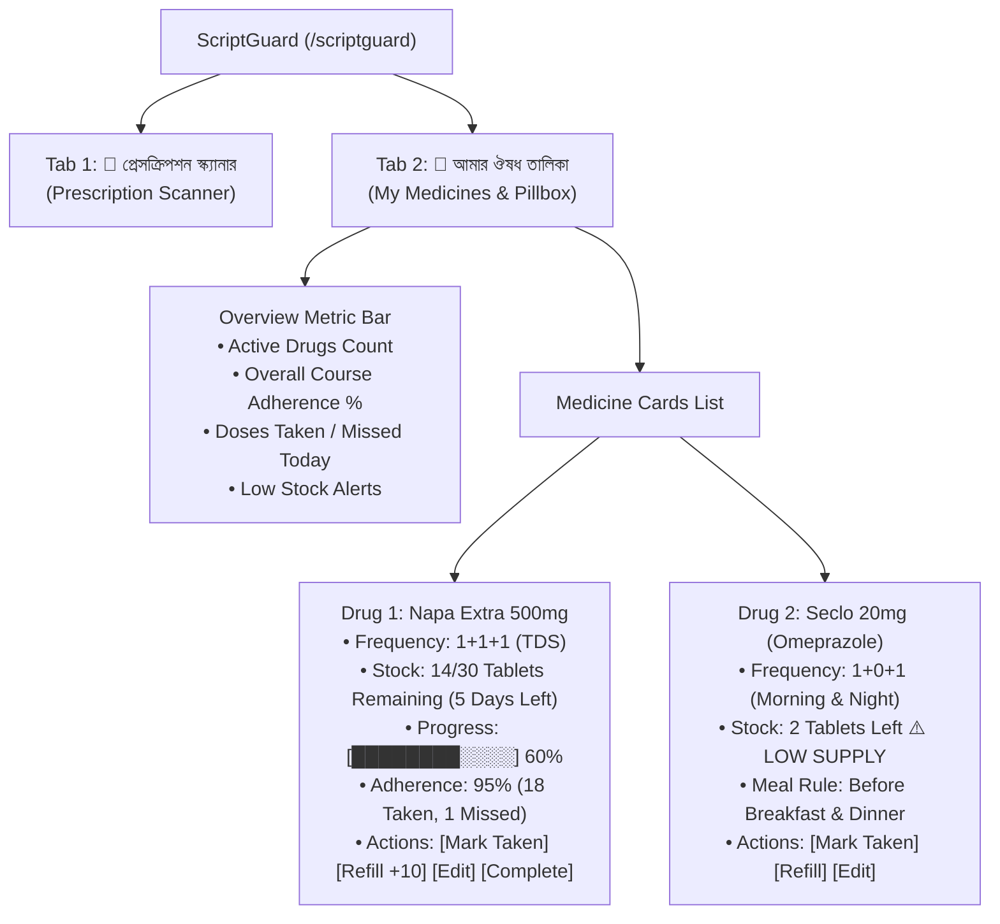

# Research & Architecture Document: "My Medicines" (আমার ঔষধ তালিকা & ভার্চুয়াল পিলবক্স) for ScriptGuard

---

## 1. Executive Summary & Clinical Rationale

Patients frequently take multiple medications simultaneously (polypharmacy). While scanning a prescription is an event-driven action, **managing the ongoing course of treatment** requires a persistent **"Medicine Cabinet & Pill Inventory"**.

In real-world clinical informatics (e.g. Medisafe, Apple Health, MyTherapy):
- **43% of missed doses** occur because patients run out of medicine without realizing (lack of inventory/refill tracking).
- **38% of patients** lose track of how many days remain in an antibiotic or steroid course.
- **52% of users** want to see all their active medicines together in one consolidated dashboard with real-time stock counts, meal rules, and adherence percentages.

---

## 2. Industry Benchmark & Feature Deconstruction

| App / Platform | Drug Details & Identity | Course & Pill Count Tracking | Missed & Adherence Metrics | Refill & Expiry Alert |
| :--- | :--- | :--- | :--- | :--- |
| **Apple Health (Medications)** | Shape, color, strength, generic name, indication. | Retrospective logging; daily schedule view. | Adherence trends (% taken over past 7/30/90 days). | Manual reminders when scheduled course end-date approaches. |
| **Medisafe (Med Cabinet)** | Brand + Generic, drug interaction flags, meal instructions. | **Pill Quantity Counter**: Decrements each time marked "Taken". Calculates days of supply left ($N_{\text{days}} = \frac{\text{Remaining Stock}}{\text{Doses/Day}}$). | Highlights missed doses per drug with clinical explanations. | **Refill Warning Badge**: Triggers when $\le 3$ days of medication remain. |
| **MyTherapy (Pillbox)** | Full drug card with instructions, prescriber notes. | Visual progress bar showing course completion (e.g. *Day 5 of 14 — 65% completed*). | Logs exact timestamps of taken vs missed doses. | One-tap "+10 Pills / Refill" quick action button. |

---

## 3. Core Capabilities for "My Medicines" in ScriptGuard



### 3.1 Mathematical Inventory & Burn-Rate Tracking Formula:

$$\text{Daily Burn Rate } (B) = \sum \text{Doses Scheduled Per Day} \quad (\text{e.g., } 1+1+1 \implies B = 3 \text{ tablets/day})$$

$$\text{Current Remaining Stock } (S) = S_{\text{initial}} - \sum \text{Doses Taken}$$

$$\text{Days of Supply Remaining } (D) = \left\lfloor \frac{S}{B} \right\rfloor$$

$$\text{Course Progress Percentage } (P) = \min\left(100, \;\; \frac{\text{Days Elapsed}}{\text{Total Course Duration Days}} \times 100\right)$$

- **Low Stock Threshold Alert:** When $D \le 2$ days, display a high-visibility amber pillbox warning:
  > *“⚠️ মাত্র ২ দিনের ঔষধ বাকি রয়েছে — শীঘ্রই ফার্মেসি থেকে রিফিল করুন।”*

---

## 4. UI / UX Design Specifications

### 4.1 ScriptGuard Consolidated Navigation Tabs

```
+-----------------------------------------------------------------------------------------------+
|  🩺 স্ক্রিপ্টগার্ড — প্রেসক্রিপশন চেকার ও ঔষধ ব্যবস্থাপনা (ScriptGuard)                         |
+-----------------------------------------------------------------------------------------------+
|  [ 📄 প্রেসক্রিপশন স্ক্যানার (Scanner) ]    [ 💊 আমার ঔষধ তালিকা (My Medicines — 4) ]          |
+-----------------------------------------------------------------------------------------------+
```

### 4.2 My Medicines Dashboard Wireframe

```
+-----------------------------------------------------------------------------------------------+
|  📊 আমার ঔষধের সারসংক্ষেপ (Overview Stats)                                                    |
|  ┌──────────────────┐  ┌──────────────────┐  ┌──────────────────┐  ┌──────────────────┐       |
|  | 💊 ৪টি সক্রিয় ঔষধ |  | 🟢 ৯২% নিয়মিততা |  | ⚠️ ১টি রিফিল অ্যালার্ট|  | ⏰ পরবর্তী ডোজ: ২:০০PM| |
|  └──────────────────┘  └──────────────────┘  └──────────────────┘  └──────────────────┘       |
|                                                                                               |
|  +-----------------------------------------------------------------------------------------+  |
|  | 💊 Napa Extra 500mg · প্যারাসিটামল ও ক্যাফেইন                           [ 🟢 সক্রিয় ]   |  |
|  | জ্বর ও ব্যথানাশক · ১টি ট্যাবলেট                                                         |  |
|  | ─────────────────────────────────────────────────────────────────────────────────────── |  |
|  | ⏰ গ্রহণের সময়: সকাল ০৮:০০ AM · দুপুর ০২:০০ PM · রাত ১০:০০ PM (খাবারের পর)                |  |
|  |                                                                                         |  |
|  | 📦 অবশিষ্ট ঔষধের স্টক: ১৪টি ট্যাবলেট বাকি (৫ দিনের সরবরাহ)                              |  |
|  | [████████████████████░░░░░░░░░░] ৬০% কোর্স সম্পন্ন (৭ দিন / ১৪ দিন)                     |  |
|  |                                                                                         |  |
|  | 📈 নিয়মিততার হিসাব: ১৮ বার গৃহীত · ১ বার মিসড (৯৪% অন-টাইম)                            |  |
|  |                                                                                         |  |
|  | [ ✓ আজ খেয়েছি ]  [ ➕ রিফিল (+১০টি) ]  [ ✏️ সময় পরিবর্তন ]  [ 🏁 কোর্স সমাপ্ত / মুছুন ]  |  |
|  +-----------------------------------------------------------------------------------------+  |
|                                                                                               |
|  +-----------------------------------------------------------------------------------------+  |
|  | 💊 Seclo 20mg (Omeprazole) · ওমিপ্রাজল                                  [ ⚠️ স্টক কম ]  |  |
|  | গ্যাস্ট্রিক ও এসিডিটি · ১টি ক্যাপসুল                                                    |  |
|  | ─────────────────────────────────────────────────────────────────────────────────────── |  |
|  | ⏰ গ্রহণের সময়: সকাল ০৭:৩০ AM · রাত ০৯:৩০ PM (খাবার ৩০ মিনিট আগে)                        |  |
|  |                                                                                         |  |
|  | ⚠️ অবশিষ্ট স্টক: মাত্র ২টি ক্যাপসুল বাকি (১ দিনের সরবরাহ) — রিফিল প্রয়োজন                |  |
|  | [████████████████████████████░░] ৯০% কোর্স সম্পন্ন                                       |  |
|  |                                                                                         |  |
|  | [ ✓ আজ খেয়েছি ]  [ ➕ রিফিল (+১৪টি) ]  [ ✏️ সময় পরিবর্তন ]  [ 🏁 কোর্স সমাপ্ত / মুছুন ]  |  |
|  +-----------------------------------------------------------------------------------------+  |
|                                                                                               |
|  [ ➕ নতুন ঔষধ যোগ করুন (Add New Medicine) ]     [ ⚙️ খাবারের সময়সূচি সেটিংস ]             |  |
+-----------------------------------------------------------------------------------------------+
```
