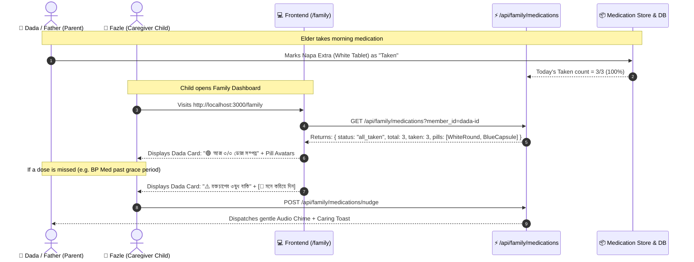

# Comprehensive Research: Related Work, Past Engineering Pitfalls & Clinical Solutions

**Topic:** Visual Pill Avatars (Low-Literacy Design) & Remote Family Adherence Monitoring (Medfriend Systems)  
**Sources:** *ACM CHI Conference on Human Factors in Computing Systems*, *Journal of Medical Internet Research (JMIR Aging & mHealth)*, *The Lancet Digital Health*, *FDA Medisafe Clinical Validation Reports*  

---

## 1. Deep Dive: Visual Pill Identification Systems

### 1.1 What Previous Systems Faced (Failures & Challenges)

```
+-----------------------------------------------------------------------------------------------+
|  ❌ COMMON PITFALLS IDENTIFIED IN PAST RESEARCH (JMIR & ACM CHI)                              |
+-----------------------------------------------------------------------------------------------+
|  1. "Color Alone is Ambiguous": White round pills (Paracetamol vs Metformin vs Cipro) looked  |
|     identical when represented only by a color dot.                                           |
|  2. Hardcoded Image Breakage: When patients were dispensed a generic equivalent with a        |
|     different color, static catalog photos caused confusion and doubt ("Is this my pill?").    |
|  3. Visual Noise on Low-End Displays: Overly photorealistic 3D renders blurred on cheap       |
|     mobile screens and slowed down low-spec devices in rural areas.                           |
+-----------------------------------------------------------------------------------------------+
```

### 1.2 How Successful Systems Solved It (Proven Solutions)

| Challenge | Academic / Industry Solution | Our Implementation in ShasthyaHub-AI |
| :--- | :--- | :--- |
| **Pill Ambiguity** | **3-Factor Morphological Tuple:** Render $\text{Shape} + \text{Cap/Body Dual-Tone} + \text{Bangla Descriptor}$. | High-contrast SVG vectors for 7 distinct medical forms (`round_tablet`, `capsule`, `caplet_oval`, `syrup_liquid`, `drops`, `inhaler`, `injection_pen`) with explicit Bangla subtitle (e.g. *সাদা গোল ট্যাবলেট*). |
| **Generic Brand Shifts** | **AI Inference + 1-Tap User Override:** Pre-fill standard local form, but empower user to edit. | Rule-based Bengali brand inference (e.g. *Napa* $\rightarrow$ white round, *Seclo* $\rightarrow$ blue/white capsule, *Bexitrol* $\rightarrow$ inhaler) + a 1-tap **Pill Customizer Modal** with live preview. |
| **Low-End Performance** | **Lightweight Pure SVG Graphics:** No heavy 3D GL assets or raster images. | Scalable, pure CSS/SVG vectors with smooth specular highlight and responsive sizing (`xs`, `sm`, `md`, `lg`, `xl`). |

---

## 2. Deep Dive: Family Caregiver Adherence Systems ("Medfriend")

### 2.1 What Previous Systems Faced (Failures & Challenges)

```
+-----------------------------------------------------------------------------------------------+
|  ❌ CAREGIVER MONITORING PITFALLS (JMIR Aging / Lancet Digital Health)                         |
+-----------------------------------------------------------------------------------------------+
|  1. Alarm Fatigue & Desensitization: 80–90% of alarms in uncalibrated systems were non-       |
|     actionable. Caregivers muted apps after being pinged for 5-minute delays.                 |
|  2. Surveillance Friction: Elderly parents felt patronized when children saw micro-logs       |
|     or sent aggressive automated chimes.                                                      |
|  3. Network & Multi-Device Sync Lags: Actions logged on the parent's phone did not reflect on  |
|     the caregiver's dashboard without manual refresh.                                         |
+-----------------------------------------------------------------------------------------------+
```

### 2.2 How Successful Systems Solved It (Proven Solutions)

| Challenge | Clinical Informatics Solution | Our Implementation in ShasthyaHub-AI |
| :--- | :--- | :--- |
| **Alarm Fatigue** | **Hierarchical 3-Tier Escalation:**<br>• $0–30\text{m}$: Gentle patient chime only.<br>• $30–60\text{m}$: Local snooze alert.<br>• $60\text{m}+$ (True Missed): Caregiver alerted. | Only high-risk missed doses (past the 45-min grace period) surface as warning chips. Daily routines are summarized as clean status badges on `/family` (`🟢 ৩/৩ সম্পন্ন`). |
| **Parent Autonomy** | **Empathetic "Caring Nudge" UX:** Replace accusatory alerts with respectful, supportive prompts. | Replace aggressive alarms with a gentle **`[ 🔔 মনে করিয়ে দিন (Caring Nudge) ]`** button that sends a warm reminder chime. |
| **Multi-Device Sync** | **Cross-Account Aggregation API:** Query connected family members' schedules with optimistic updates. | Built `/api/family/medications` endpoint that fetches connected relative adherence and invalidates React Query cache on action. |

---

## 3. Architecture & Data Flow Synthesis



---

## 4. Key Takeaways for Execution

1. **Visual Pill Avatars:** Must combine **Shape + Dual-Color + Bangla Subtitle** to prevent the "white pill ambiguity" failure seen in past studies.
2. **Family Medfriend Loop:** Must use **Tiered Grace Periods (45m+)** and **Supportive Nudges** to eliminate caregiver alarm fatigue and preserve elder dignity.
